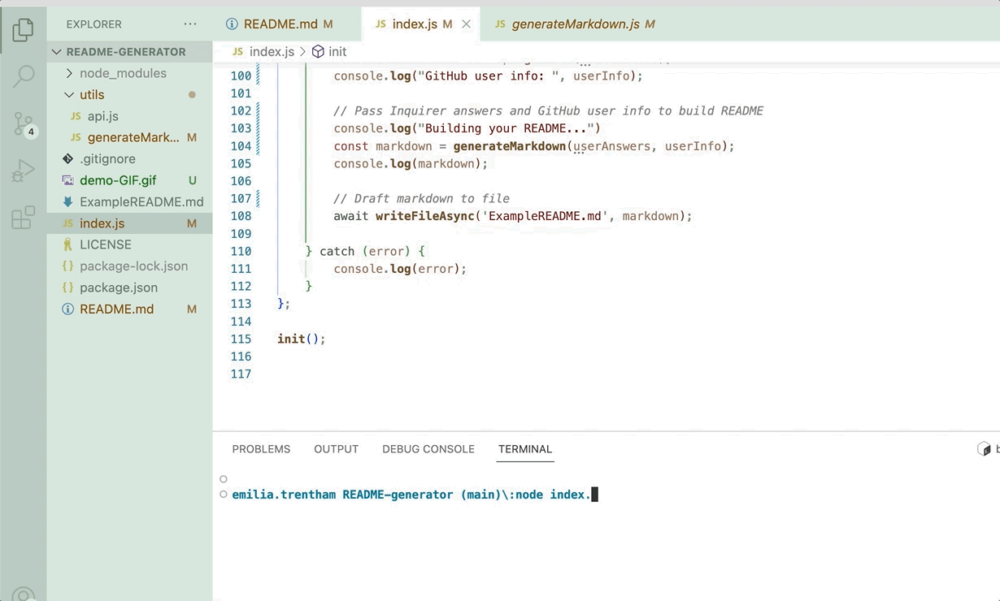

# README.md Generator:  Node.js 

## Description 

A command-line application that runs with Node.js and dynamically generates a README.md file based on user input. Check out the [`ExampleREADME.md`](https://github.com/emiliatrentham/README-generator/blob/main/ExampleREADME.md) here!

## User Story

```
AS A developer 
I WANT a README generator
SO THAT I can quickly create a professional README for a new project

```

## Table of Contents
* [Installation](#installation)
* [Usage](#usage)
* [Features](#features)
* [License](#license)


## Installation

To generate your own README file, `git clone` the repo so you have the Node project on your local machine.

Run `npm install` to install the npm package dependencies specified in the `package.json`:

  * [`inquirer`](https://www.npmjs.com/package/inquirer)  prompts user input.
  * [`axios`](https://www.npmjs.com/package/axios) fetches user data from the GitHub API.

To start the application run `node index.js` in the command line then answer the prompts to generate a README file.

The README has some automatically generated badges from shields.io and will also include the users profile picture & username from GitHub.


## Usage 



After running `node index.js`, the application uses the `inquirer` package to prompt the user in the command line with a series of questions about the project.

The application then takes the user's responses and uses `axios` to fetch a GitHub profile from the [GitHub API](https://developer.github.com/v3/), including a profile picture or avatar, and username.

Subsequently, the application will generate markdown for the README based on the user's responses to the Inquirer prompts and `fs.writeFile` is used to generate the file named `ExampleREADME.md`.  

## Features

This project utilizes modularization by separating the GitHub API call and generation of the markdown into individual modules.

Syntax and paradigms introduced in ES6 and after are also used, including:

- Arrow functions, 
- `const`, `let`, 
- Template literals, and
- `async/await` to handle `inquirer`, `axios`, and `fs.writeFile` promises.


## License

MIT License

---

## Questions?


Reach out with any questions!

GitHub: [@emiliatrentham](https://github.com/emiliatrentham)
